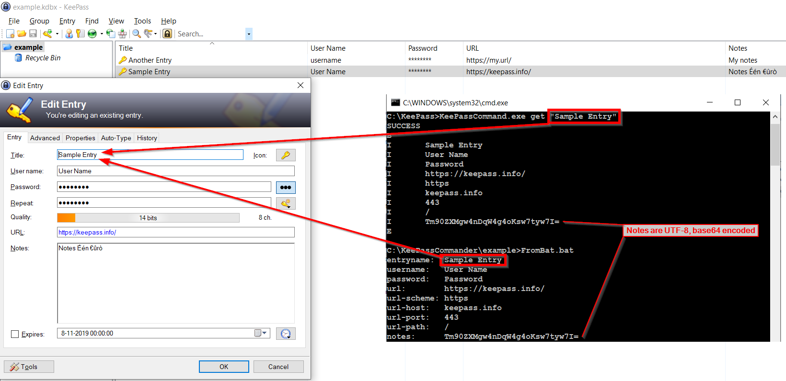

[](https://github.com/MircoBabin/KeePassCommander/releases)
[](https://github.com/MircoBabin/KeePassCommander/blob/master/LICENSE.md)

# KeePass Commander
KeePass Commander is a plugin for the [KeePass password store](https://keepass.info/ "KeePass") program. 
It is a command-line tool that provides a communication channel for PHP scripts, Windows CMD/BAT/PowerShell scripts, Python, C#, git, etc. to query the KeePass password store without requiring configuration or passwords.

It can also query KeePass from within a [Virtual Machine](docs/VirtualMachine.md). Read the [documentation here](docs/VirtualMachine.md).



# Download binary
For Windows (.NET framework 4), [the latest version can be found here](https://github.com/MircoBabin/KeePassCommander/releases/latest "Latest Version").
The plugin works with KeePass 2.44. Because the plugin barely uses anything from KeePass, it will probably work with all future KeePass versions.

Download the zip and unpack it in the KeePass directory where KeePass.exe is located.

The minimum .NET framework required is 4.0.
.NET framework version 3.5 is the first framework to implement the System.IO.Pipes namespace, but KeePass only supports v4.0 and v2.0.50727.

*For unattended automatic installation scripts, read the section "Automatic installation scripts" lower down the page.*

# Help

Execute **KeePassCommand.exe** without parameters to view the help.

```
KeePassCommand 4.2
https://github.com/MircoBabin/KeePassCommander - MIT license

KeePass Commander is a plugin for the KeePass password store (https://keepass.info/).
It is a command-line tool that provides a communication channel for PHP scripts, Windows CMD/BAT/PowerShell scripts, Python, C#, git, etc. to query the KeePass password store without requiring configuration or passwords.

Syntax: KeePassCommand.exe <command> {-filesystem:folderpath OR -namedpipe} {-out:outputfilename OR -out-utf8:outputfilename} ...
- If neither -filesystem nor -namedpipe is specified, the default will be Named Pipe. Unless the configuration file KeePassCommand.config.xml specifies other.
- When -namedpipe is specified, communication will be encrypted via a Named Pipe.
- When -filesystem:folderpath is specified, communication will be via encrypted files inside shared folder folderpath. A special KeePass entry with title starting with "KeePassCommander.FileSystem", with folderpath as url, and notes like listgroup must be present for this to work. The purpose is querying from inside a Virtual Machine. See https://github.com/MircoBabin/KeePassCommander/docs/VirtualMachine.md for more information.
- Unless -out or -out-utf8 is used, output will be at the console (STDOUT).
- When -out-utf8:outputfile is used, output will be written in outputfile using UTF-8 codepage.
- When -out:outputfile is used, output will be written in outputfile using ANSI codepage.
- "KeePass-entry-title" must exactly match (case sensitive), there is no fuzzy logic. All open databases in KeePass are searched.
- When the expected "KeePass-entry-title" is not found (you know it must be there), you can assume KeePass is not started or the required database is not opened.

* Basic get
KeePassCommand.exe get "KeePass-entry-title" "KeePass-entry-title" ...
e.g. KeePassCommand.exe get "Sample Entry"
- "Note" is outputted as UTF-8, base64 encoded.

* Advanced get string field
KeePassCommand.exe getfield "KeePass-entry-title" "fieldname" "fieldname" ...
e.g. KeePassCommand.exe getfield "Sample Entry" "extra field 1" "extra password 1"
- "Value" is outputted as UTF-8, base64 encoded.

* Advanced get string field raw into file
KeePassCommand.exe getfieldraw <-out-utf8:outputfile or -out:> "KeePass-entry-title" "fieldname"
e.g. KeePassCommand.exe getfieldraw -out-utf8:myfield.txt "Sample Entry" "extra field 1"
- With -out-utf8, "Value" is outputted as UTF-8.
- With -out, "Value" is outputted in ANSI codepage.

* Advanced get file attachment
KeePassCommand.exe getattachment "KeePass-entry-title" "attachmentname" "attachmentname" ...
e.g. KeePassCommand.exe getattachment "Sample Entry" "example_attachment.txt"
- Attachment is outputted as binary, base64 encoded.

* Advanced get file attachment raw into file
KeePassCommand.exe getattachmentraw -out:outputfilename "KeePass-entry-title" "attachmentname"
e.g. KeePassCommand.exe getattachmentraw -out:myfile.txt "Sample Entry" "example_attachment.txt"
- Attachment is saved in outputfilename, outputted as binary.

* Advanced get note
KeePassCommand.exe getnote "KeePass-entry-title" "KeePass-entry-title" ...
e.g. KeePassCommand.exe getnote "Sample Entry"
- "Note" is outputted as UTF-8, base64 encoded.

* Advanced get note into file
KeePassCommand.exe getnoteraw <-out-utf8:outputfile or -out:> "KeePass-entry-title"
e.g. KeePassCommand.exe getnoteraw -out-utf8:mynote.txt "Sample Entry"
- With -out-utf8, "Note" is outputted as UTF-8.
- With -out, "Note" is outputted in ANSI codepage.

* Advanced list titles in group
KeePassCommand.exe listgroup "KeePass-entry-title"
e.g. KeePassCommand.exe listgroup "All Entries"
- The queried entry note may contain the line "KeePassCommanderListGroup=true".
  This is not recursive, only titles in the current group are listed.
- The queried entry note may contain lines "KeePassCommanderListAddItem={title}".
- Output is one title per line, unique sorted on titlename.
- There is no SUCCESS or ERROR indication in the output.

```

# Examples

Examples are found in the github directory **example**.

- example.kdbx is a KeePass database. It's master password is **example**.
- [FromPhp.php](example/FromPhp.php) can be used to query the KeePass password store from PHP. With minimal modifications you can use it anywhere.
- [FromBat.bat](example/FromBat.bat) can be used to query the KeePass password store from a BAT file. With minimal modifications you can use it anywhere.
- [FromPowershell.ps1](example/FromPowershell.ps1) can be used to query the KeePass password store from PowerShell. With minimal modifications you can use it anywhere.
- [FromPython.py](example/FromPython.py) can be used to query the KeePass password store from Python. With minimal modifications you can use it anywhere.
- [CsharpExample](example/CsharpExample/src/CsharpExample/Program.cs) can be used to query the KeePass password store from C#. With minimal modifications you can use it anywhere.

# GIT

Using [Git Credentials via KeePassCommander](https://github.com/MircoBabin/GitCredentialsViaKeePassCommander) the credentials for git repositories can be queried from KeePass upon a pull or push command.

# Code signing certificate

Using [BuildStamp](https://github.com/MircoBabin/BuildStamp) the code signing certificate can be stored in the KeePass password store. And used to digitally sign executables.

# Virtual Machine

Via a shared folder it is possible to query the KeePass password store on the host (running outside the Virtual Machine) from within a Virtual Machine. Read the [documentation here](docs/VirtualMachine.md).

# Listgroup

With the ```listgroup``` command multiple titles can be grouped in KeePass. They can be processed in a ```foreach``` kind a manner. Read the [documentation here](docs/ListGroup.md).

# Why
The plugin [KeePassHttp](https://github.com/pfn/keepasshttp/) already exists for querying the password store. 
I did not want to use this plugin, because it embeds a http server inside KeePass. 
And I don't want to "pair" with a code, because I want to communicate from the commandline, without configuration.

So I build KeePassCommander.dll plugin which runs a Windows named-pipe-server inside KeePass. And a KeePassCommand.exe commandline tool to communicate with KeePassCommander.dll. 

I'm using this plugin among other things to automate DeployHQ. In KeePass I store the DeployHQ API key. From a php script the API key is queried and then used.

When I had to maintain a Delphi project, I decided it was best to install a development Virtual Machine. The VM contains the Delphi Alexandria IDE and lots of purchased components that were installed scattered all around the virtual harddisk. Because I run KeePass on the host (outside the Virtual Machine) and use Git inside the Virtual Machine, I created a new filesystem communication channel, next to the named pipe communication channel. This way I still have one KeePass (outside the Virtual Machine) that is also used inside the Virtual Machine. Making it possible to backup the Virtual Machine without having any passwords inside it.

# Automatic installation scripts
For unattended installation scripts the following flow can be used for the latest version:

1) Download https://github.com/MircoBabin/KeePassCommander/releases/latest/download/release.download.zip.url-location
2) Read the text of this file into **latest-download-url**. The file only contains an url, so the encoding is ASCII. *The encoding UTF-8 may also be used to read the file, because ASCII is UTF-8 encoding.*
3) Download the zip from the **latest-download-url** to local file **KeePassCommander.zip**. *Each release carries the version number in the filename. To prevent not knowing the downloaded filename, download to a fixed local filename.*
4) Unpack the downloaded **KeePassCommander.zip** in the KeePass directory where KeePass.exe is located.

# Debug

Via KeePass commandline options this plugin can write logging. Use --KeePassCommanderDebug=*full-path-to-filename* to specify the filename.

```
KeePass.exe --debug --KeePassCommanderDebug=c:\incoming\KeePassCommander.log
```

# Contributions
Contributions are welcome. Please read [CONTRIBUTING.md](CONTRIBUTING.md "contributing") before making any contribution!

# License
[The license is MIT.](LICENSE.md "license")


