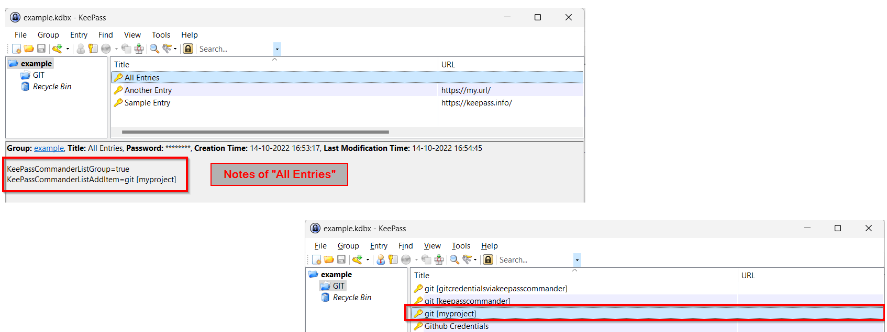

# List Group

The ```listgroup``` command targets the notes section of one KeePass title. The notes must specify what titles are listed.

By listing the titles in one Keepass entry, all titles are kept in KeePass and not in several scripts outside KeePass. Each title can be processed with the ```get``` command. In this way, multiple titles with the same functionality can be processed as a ```foreach```.

The **stdout** output of ```listgroup``` is one title per line. Each listed title is unique and the titles are sorted ascending.
When an error occurs, e.g. the queried title does not exist or KeePass is not running, there will be 0 lines of output. There won't be any error messages outputted.

e.g.

```
... check if the "All Entries" exists, because listgroup won't output an error ...

KeePassCommand.exe get "All Entries"
if not found then
    begin
        print 'KeePass is closed, locked or the database has not been opened. Entry "All Entries" was not found.'
        die
    end;


... use listgroup, the entry exists ...

KeePassCommand.exe listgroup "All Entries"
foreach(title in stdout) do
begin
    KeePassCommand.exe get "title"
    
    ... do something with retrieved url/username/password/notes ... 
    
end;
```    

## Current group

When the notes contain a line ```KeePassCommanderListGroup=true``` all the titles of the current group are listed.
This is not recursive, so titles in subgroups or parentgroups are not listed.

The queried titlename (e.g. "All Entries") is always excluded from the list.

## One specific title

A line ```KeePassCommanderListAddItem=...title...``` adds one specific title. Replace ```...title...``` with the exact title of a KeePass entry.

That title can be in any group of any opened KeePass database. Remember that a title is case sensitive, uppercase and lowercase are important.

Multiple specific titles are added, by adding multiple lines ```KeePassCommanderListAddItem=...title...``` to the notes.

## Example

The Example database contains the title ```All Entries```.



The notes of ```All Entries``` specify the current group (the root group named "example") plus the specific title "git \[myproject\]".


